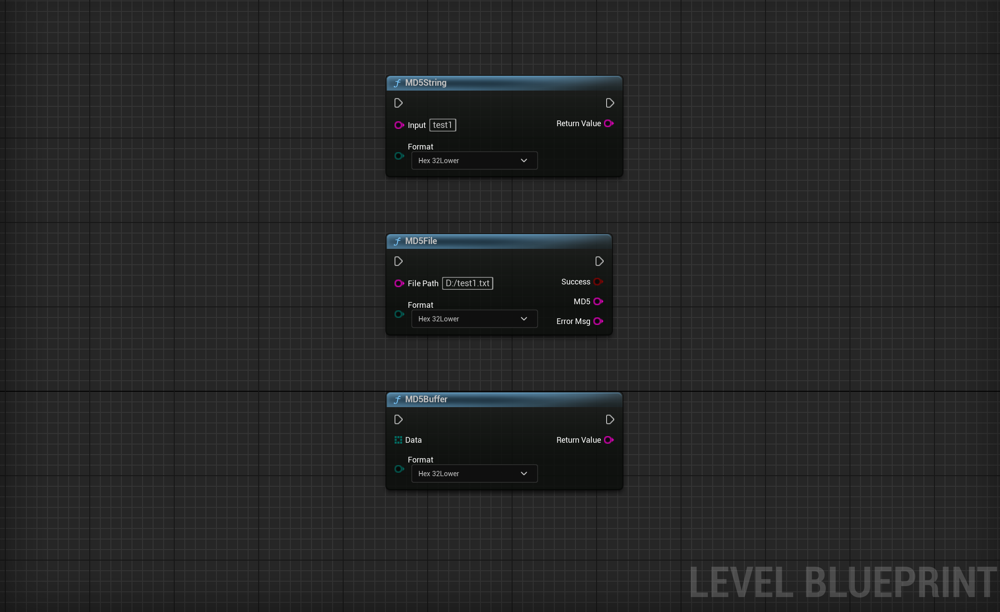

# GRMD5Toolkit
This is UE5's toolbox for handling MD5.

Quick Start
1.Perform MD5 encryption on a string
   Perform MD5 encryption on a local file [absolute path]
   Perform MD5 encryption on binary bytes

2.Output MD5 in 32-character lowercase, 32-character uppercase, 16-character lowercase, and 16-character uppercase formats

